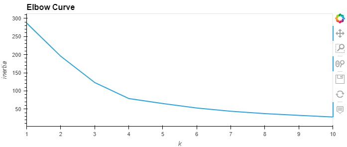
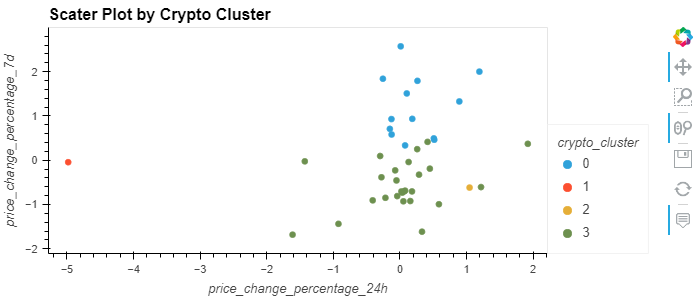
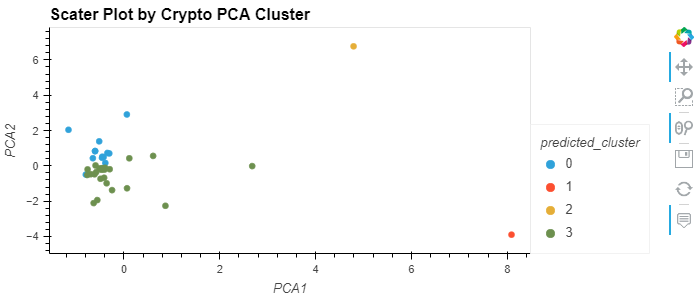

# CryptoClustering - Module 19 Challenge

I used used my knowledge of Python and unsupervised learning to predict if cryptocurrencies are affected by 24-hour or 7-day price changes.  This included the K-Means clustering as well as the dimension resampling using Principal Component Analysis (PCA) on clustering.

### Initial Data

1. Elbow curve for the Initial data.

2. Elbow curve for the PCA data.

3. Scatter plot of cryptocurrency clusters based on the original data.

4. Scatter plot of cryptocurrency clusters based on the PCA data.

