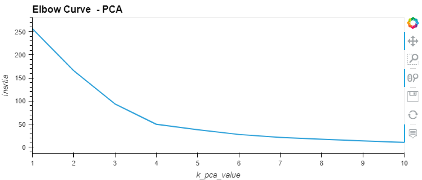

# CryptoClustering - Module 19 Challenge

I used used my knowledge of Python and unsupervised learning to predict if cryptocurrencies are affected by 24-hour or 7-day price changes.  This included the K-Means clustering as well as the dimension resampling using Principal Component Analysis (PCA) on clustering.

### Elbow Curve Data

- Elbow curve for the Initial data:

- Elbow curve for the PCA data:

### Scatter Plot Data

- Scatter plot for the original data clusters:

- Scatter plot for the PCA data clusters:

